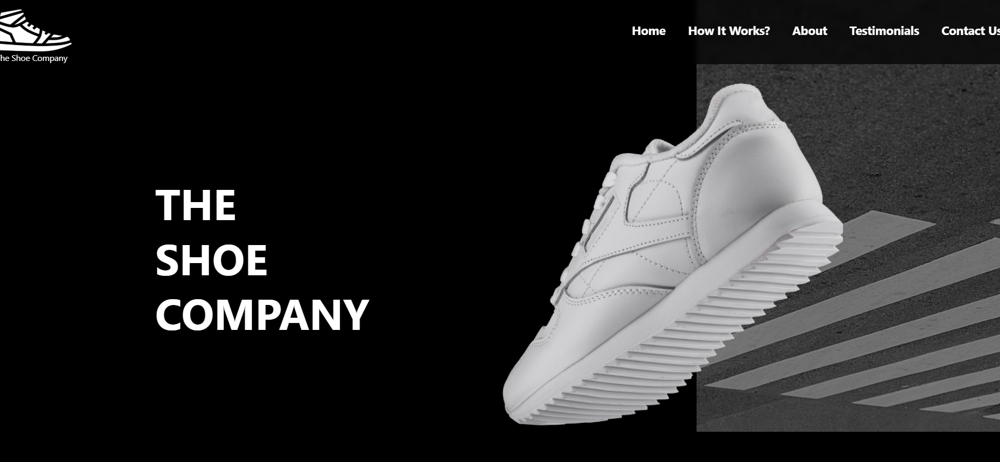
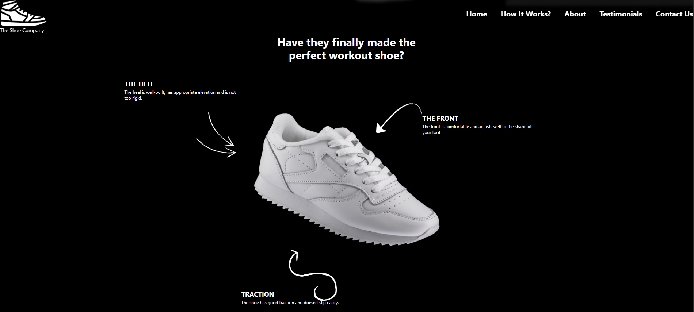
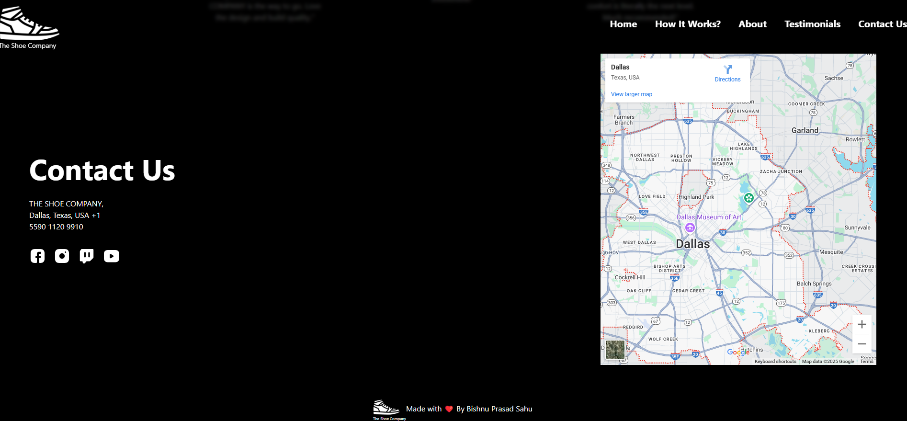

# 👟 Shoe Company Frontend Website

This project is a **visually appealing and responsive frontend** for a fictional Shoe Company, designed using **HTML**, **Tailwind CSS**, and a bit of custom CSS. The focus of this project is on clean, modern UI design and a great user experience across all devices.

---

## 🎯 Project Purpose

The aim of this project was to design a professional and elegant user interface for a product-based brand, specifically a shoe company. It demonstrates strong skills in responsive layout design, Tailwind utility-first styling, and frontend architecture — ideal for showcasing on a portfolio.

---

## ✨ Features

- ✅ **Fully responsive design** that adapts smoothly across mobile, tablet, and desktop.
- 🎨 **Tailwind CSS-powered styling** for clean, maintainable, and scalable code.
- 🚀 **Optimized layout** with hero banners, product displays, and brand sections.
- 🔄 **Hover and transition effects** for interactive product cards.
- 📦 **Reusable components** for product cards, CTA buttons, and navigation items.
- 🦶 **Footer with useful links**, branding, and social media icons.
- 🛒 Placeholder elements for "Add to Cart" and product detail interaction.

---

## 🛠️ Built With

- **HTML5** – for markup structure  
- **Tailwind CSS** – for styling and layout  
- **Custom CSS** – for enhancements and special overrides  
- **Responsive Design Techniques** – using media queries and Tailwind utilities

---

## 📸 Screenshots

## 🚀 Getting Started

### 🔧 Installation

1. Clone this repository:

   git clone https://github.com/Bishnu-prasad-Sahu/Fully-Responsive-Shoe-Company-Frontend.git

2. Navigate to the project directory:

        cd shoe-company-frontend

If you're using Tailwind CLI or PostCSS, make sure to build the final CSS using:

        npx tailwindcss -i ./input.css -o ./style.css --watch

📂 Folder Structure

shoe-company-frontend/
├── index.html
├── style.css               
├── tailwind.config.js      
├── input.css               
├── homepage.png
└── products.png
└── README.md

📈 Future Improvements
Integrate JavaScript for interactivity (e.g., cart system, product filtering)
Add backend for product management and checkout
Improve accessibility with ARIA roles and semantic tags
Add animation using Tailwind plugins or Framer Motion
Lime Demo will be updated soon

Author : Bishnu Prasad Sahu